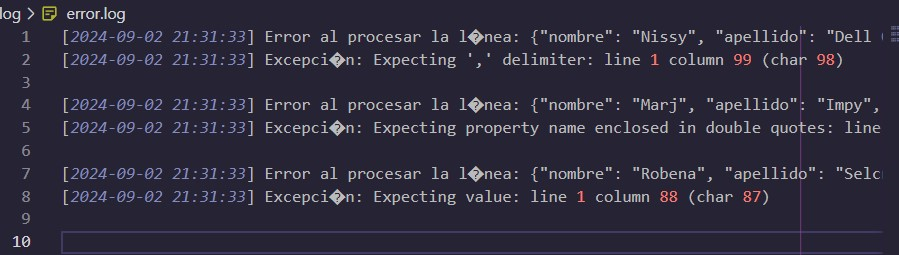
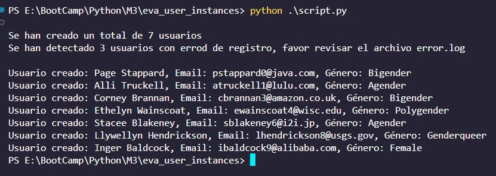

# Evaluación  - Instancias de Usuario

Dentro de este proyecto se apoya de un codigo base y un archivo tipo "txt" con los datos en el cual debemos crear un script el cual debera de iterar, validar y crear los usuarios mencionados en el archivo "usuarios.txt", adicionalmente se debe de crear un archivo log con los errores detectados.

### Ejecucion

Para la ejecucion basta con ejecutar el siguiente codigo dentro de nuestra terminal. Cabe mencionar que script automaticamente crea la carpeta log con el archivo error.log.

```bash
  python script.py
```

### Resultados esperados

#### Muestra del error.log


#### Resultado de la terminal
